# Default configurations

Scroll with Ctrl+Alt+Left and Ctrl+Alt+Right or by moving mouse to left / right screen edge (if enabled)
- In carousel layouts, you can scroll infinitely
- In normal layouts, you can scroll when there are more windows than the layout can fit

## SINGLE TILE CAROUSEL

✅ Multi-monitor friendly


```
{"carousel":true}
0:0,0,100,100
```

## THREE TILE CAROUSEL
Improved scrolling experience compared to SINGLE TILE CAROUSEL at the cost of multi-monitor friendliness

❌ Multi-monitor friendly

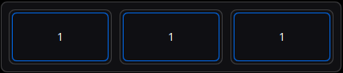

```
{"carousel":true}
0:0,0,100,100
0:0,0,100,100+1:100,0,100,100
-1:-100,0,100,100+0:0,0,100,100+1:100,0,100,100
```

## 50% CAROUSEL
❌ Multi-monitor friendly


```
{"carousel":true,"focusAction":0}
0:25,0,50,100
0:25,0,50,100+1:75,0,50,100
-1:-25,0,50,100+0:25,0,50,100+1:75,0,50,100
```

## 66% CAROUSEL
❌ Multi-monitor friendly

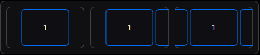
```
{"carousel":true,"focusAction":0}
0:17,0,66,100
0:17,0,66,100+1:83,0,66,100
-1:-49,0,66,100+0:17,0,66,100+1:83,0,66,100
```

## 96% CAROUSEL
❌ Multi-monitor friendly

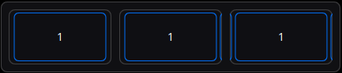
```
{"carousel":true,"focusAction":0}
0:2,0,96,100
0:2,0,96,100+1:98,0,96,100
-1:-94,0,96,100+0:2,0,96,100+1:98,0,96,100
```

## 3 CARD STACK
✅ Multi-monitor friendly

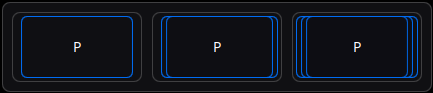
```
{"carousel":true,"focusAction":0,"tileTextMode":2,"sortZ":false}
0:4,0,92,100
1:8,0,92,100+0:4,0,92,100
-1:0,0,92,100+1:8,0,92,100+0:4,0,92,100
```

## 5 CARD STACK
✅ Multi-monitor friendly

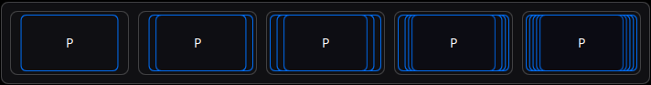
```
{"carousel":true,"focusAction":0,"tileTextMode":2,"sortZ":false}
0:6,0,88,100
1:12,0,88,100+0:6,0,88,100
-1:0,0,88,100+1:12,0,88,100+0:6,0,88,100
-1:0,0,88,100+2:12,0,88,100+1:9,0,88,100+0:6,0,88,100
-2:0,0,88,100+-1:3,0,88,100+2:12,0,88,100+1:9,0,88,100+0:6,0,88,100
```

## SPIRAL 4
✅ Multi-monitor friendly

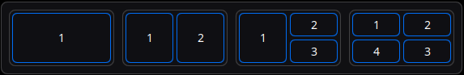
```
0:0,0,100,100
0:0,0,50,100+1:50,0,50,100
0:0,0,50,100+1:50,0,50,50+2:50,50,50,50
0:0,0,50,50+3:0,50,50,50+1:50,0,50,50+2:50,50,50,50
```

## SPIRAL 8
✅ Multi-monitor friendly

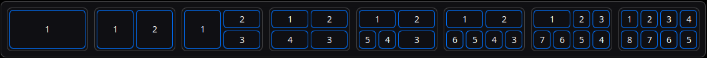
```
0:0,0,100,100
0:0,0,50,100+1:50,0,50,100
0:0,0,50,100+1:50,0,50,50+2:50,50,50,50
0:0,0,50,50+3:0,50,50,50+1:50,0,50,50+2:50,50,50,50
0:0,0,50,50+4:0,50,25,50+3:25,50,25,50+1:50,0,50,50+2:50,50,50,50
0:0,0,50,50+5:0,50,25,50+4:25,50,25,50+1:50,0,50,50+3:50,50,25,50+2:75,50,25,50
0:0,0,50,50+6:0,50,25,50+5:25,50,25,50+1:50,0,25,50+2:75,0,25,50+4:50,50,25,50+3:75,50,25,50
0:0,0,25,50+1:25,0,25,50+7:0,50,25,50+6:25,50,25,50+2:50,0,25,50+3:75,0,25,50+5:50,50,25,50+4:75,50,25,50
```

## 50% + 2 STACK
✅ Multi-monitor friendly

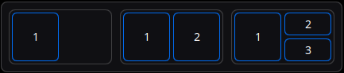
```
0:0,0,50,100
0:0,0,50,100+1:50,0,50,100
0:0,0,50,100+1:50,0,50,50+2:50,50,50,50
```

## 50% + 3 STACK
✅ Multi-monitor friendly

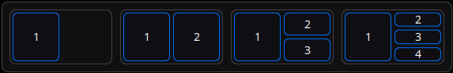
```
0:0,0,50,100
0:0,0,50,100+1:50,0,50,100
0:0,0,50,100+1:50,0,50,50+2:50,50,50,50
0:0,0,50,100+1:50,0,50,33+2:50,33,50,34+3:50,67,50,33
```

## 67% + 2 STACK
✅ Multi-monitor friendly


```
0:0,0,67,100
0:0,0,67,100+1:67,0,33,100
0:0,0,67,100+1:67,0,33,50+2:67,50,33,50
```

## 67% + 3 STACK
✅ Multi-monitor friendly

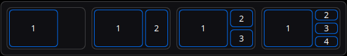
```
0:0,0,67,100
0:0,0,67,100+1:67,0,33,100
0:0,0,67,100+1:67,0,33,50+2:67,50,33,50
0:0,0,67,100+1:67,0,33,33+2:67,33,33,34+3:67,67,33,33
```

## 2 + 50% + 2 STACK
✅ Multi-monitor friendly

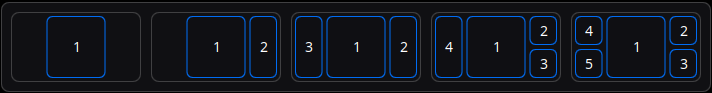
```
0:25,0,50,100
0:25,0,50,100+1:75,0,25,100
2:0,0,25,100+0:25,0,50,100+1:75,0,25,100
3:0,0,25,100+0:25,0,50,100+1:75,0,25,50+2:75,50,25,50
3:0,0,25,50+4:0,50,25,50+0:25,0,50,100+1:75,0,25,50+2:75,50,25,50
```

## * | 1 + 50% + * | 1 CAROUSEL
✅ Multi-monitor friendly

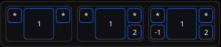
```
{"carousel":true,"focusAction":0}
*:0,0,25,50+0:25,0,50,100+*:75,0,25,50
*:0,0,25,50+0:25,0,50,100+*:75,0,25,50+1:75,50,25,50
*:0,0,25,50+-1:0,50,25,50+0:25,0,50,100+*:75,0,25,50+1:75,50,25,50
```

## 1 | * + 50% + 1 | * CAROUSEL
✅ Multi-monitor friendly


```
{"carousel":true,"focusAction":0}
*:0,50,25,50+0:25,0,50,100+*:75,50,25,50
*:0,50,25,50+0:25,0,50,100+1:75,0,25,50+*:75,50,25,50
-1:0,0,25,50+*:0,50,25,50+0:25,0,50,100+1:75,0,25,50+*:75,50,25,50
```

# Custom auto tiler configuration

Example:

{"carousel":false,"focusAction":0}

## Valid configuration options

### "carousel":true|false
default: system settings value - will always be true if any negative tiles are included in the layout even if manual value is set to false

### "clip":true|false
* true = clip preview in popup grid (costly to render)
* false = no clipping, tiles will render outside of the popup grid layout (use if you use tiles that span multiple screens)

default: true if carousel is true otherwise false

### "autoTileAction":0|1
* 0 = insert before
* 1 = insert after

default: system settings value

### "autoTileIndex":-1|0|1|2|...|16
default: system settings value

### "focusAction":0|1|2|3|4|5
* 0 = scroll to focused
* 1 = insert focused window at index
* 2 = insert focused window at index - ignore primary
* 3 = swap place with window at index
* 4 = swap place with window at index - ignore primary
* 5 = do nothing

default: system settings value

### "focusIndex":-1|0|1|2|...|16
default: system settings value

### "minimizedFocusAction":0|1|2
* 0 = scroll as close as possible
* 1 = insert before window at index
* 2 = swap place with window at index

default: system settings value

### "minimizedFocusIndex":-1|0|1|2|...|16
default: system settings value

### "dragSwapAction":0|1
* 0 = insert dragged window at target priority
* 1 = swap places

default: system settings value

### "tileTextMode":0|1|2
* 0 = show human readable index - 1 for primary, 2 for secondary... -1 for last, * is fixed tiles
* 1 = show exact index - 0 is primary, 1 is secondary... -1 is last, -2 is second to last, * is fixed tile
* 2 = show simple index - P for primary, * for fixed tiles other tiles have no text

default: 0

### "sortZ":true|false
* true = tiles will be sorted by their priority index, the lower the priority the higher the tile is - focused tile is always on top
* false = tiles will be sorted by their order, with last tile being higher - focused tile is always on top
default: true